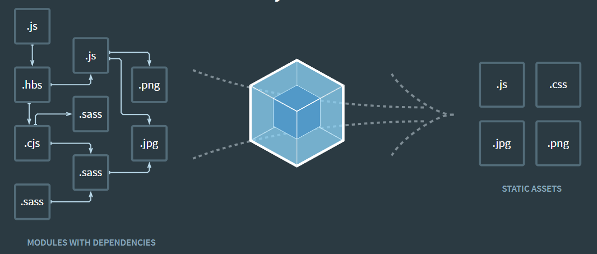

# WebPack  
## IIFE  
즉시 실행 함수 표현으로 정의 되자마자 즉시 실행되는 Javascript 함수를 의미한다.  
`````
(function(){
    statement
})();
`````  
## CommonJS  
CommonJS는 자바스크립트를 사용하는 모든 환경에서 모듈을 하는 것이 목표이다.  
exports 키워드로 모듈을 만들고 require() 함수로 불러들이는 방식이다.  
대표적으로 서버 사이드 플랫폼인 Nodejs에서 사용한다.  
* ES6 이전 방식  
- math.js  
````
export function sum(a, b){return a + b};
````  
- app.js  
````
const sum = require('./math.js');
sum(1,2);
````  
* ES6 방식  
- math.js  
````
export function sum(a, b){return a + b};
````  
- app.js  
````
import * as math from './math.js'
math.sum(1,2);
````  
## 모듈 시스템 사용방법  
````
<script type="module" src="src/app.js"></script>
````  
````
npx lite-server// 이 명령어로 간단하게 해당 디렉토리에 있는 파일을   
서버에서 실행할 수 있다
````  
&nbsp;  
## webpack의 역할  
  
웹팩은 모듈로 연결된 여러가지 자바스크립트 파일을 합쳐주는 역할을 한다.  
위의 이미지에서 보면 왼쪽의 모든 자바스크립트 파일이 합쳐져서  
오른쪽에 있는 파일들 처럼 합쳐주는 것이 번들링 이라고한다.  
이렇게 하나로 합쳐진 파일을 번들(bundle)이라고 한다.  
웹팩을 설치해서 번들링하는 작업을 해보자.  
````
npm install -D webpack webpack-cli// 여기서 -D를 넣는 거는 개발용 Dpendency 설정을 위해 해주는 것이다. 
````  
- package.json  
````
{
  "name": "sample",
  "version": "1.0.0",
  "description": "",
  "main": "index.js",
  "scripts": {
    "test": "echo \"Error: no test specified\" && exit 1",
    "build": "echo \"여기에 빌드 스크립트를 추가합니다.\""
  },
  "author": "",
  "license": "ISC",
  "dependencies": {
    "react": "^16.13.1"
  },
  "devDependencies": {// -D를 줘서 이렇게 따로 설정되는데 이것은 개발용 Dependencies이다.
  //설치된 라이브러리는 node_modules에 .bin폴더에 있다.
    "webpack": "^4.43.0",
    "webpack-cli": "^3.3.11"
  }
}
````  

## Entry  
  
개념: 모듈의 시작점으로 위의 사진에서 왼쪽 맨위의 js파일의 위치를  
Entry Point라고 한다.   
### 필수 옵션 3가지  
- --mode: ["development","production","none"] 과 같이 3가지 옵션을 선택할 수 있다.   
개발환경(development)이냐, 운영환경(production)이냐에 따라 옵션을 다르게준다.  
- --entry: 모듈의 시작점을 설정해주는 옵션이다.  
- --output, -o: entry를 통해서 모듈들을 합치고 저장하는 경로를 설정하는 옵션이다.  
&nbsp;  
## 웹팩 명령어 사용을 위한 설정 및 웹팩 설정 방법  
````
Set-ExecutionPolicy RemoteSigned // 윈도우 쉘에서는 따로 설정해줘야한다.

//모드를 개발환경으로 설정하고, 웹팩 모듈의 시작점은 app.js  output은 dist 폴더에 main.js로 저장한다.
node_modules/.bin/webpack --mode development --entry ./src/app.js --output dist/main.js 
````  
## 번들링 결과  
아까 output으로 설정했듯이, dist 폴더에 main.js로 저장이된다.  
번들링된 파일은 html에서 아래와 같이 불러올 수 있다.  
````
<!DOCTYPE html>
<html lang="en">
<head>
    <meta charset="UTF-8">
    <meta name="viewport" content="width=device-width, initial-scale=1.0">
    <title>Document</title>
    <!-- <script src="math.js"></script> -->
    <script src="../dist/main.js"></script>
</head>
<body>
    
</body>
</html>
````  
## --config 옵션  
하지만 위의 방식은 웹팩에 옵션이 많아지는 경우 터미널로 작업하기   
어렵기 때문에, --config라는 옵션을 이용하여 웹팩 설정파일을 만들어야한다.  
--config 명령어는 웹팩 설정파일을 지정 할수 있는 옵션이다.  
기본 파일명은 webpack.config.js이다.  
## webpack.config.js 구조  
````
const path = require('path')

//module.exports는 노드의 모듈 시스템이다.
module.exports = {
    mode: 'development',
    entry: {
        main: './src/app.js'
    },
    output: {
        path: path.resolve('./dist'),//output 디렉토리명을 입력. 
                                     //절대경로를 입력하는데, 노드의 path 모듈을 import하여 사용한다.
        filename: '[name].js'//여기서 name은 entry에서 설정한 키값으로 치환되어 main.js로 생기게된다.
    }
}
````  
## 웹팩으로 코드를 번들링하는 과정을 npm 스크립트 코드에 등록  
````
{
  "name": "sample",
  "version": "1.0.0",
  "description": "",
  "main": "index.js",
  "scripts": {
    "test": "echo \"Error: no test specified\" && exit 1",
    "print": "echo \"여기에 빌드 스크립트를 추가합니다.\"",
    "build": "webpack"  //<--웹팩을 빌드하는 스크립트를 추가했다.
  },
  "author": "",
  "license": "ISC",
  "dependencies": {
    "react": "^16.13.1"
  },
  "devDependencies": {
    "webpack": "^4.43.0",
    "webpack-cli": "^3.3.11"
  }
}
````  
- 실행  
````
npm run build
````  

## 로더  
웹팩에서 로더의 역할은 모든 파일을 자바스크립트의 모듈 처럼 만들어준다.  
- my-webpack-loader.js (로더)  
````
//로더는 함수형태로 작성한다.
module.exports = function myWebpackLoader(content){
    console.log('myWebpackLoader 동작함')
    return content;
}
````
- 모든 console.log를 alert으로 치환시키고 싶은경우  
````
module.exports = function myWebpackLoader(content){
    console.log('로더 동작')
    return content.replace('console.log(', 'alert(')//모든 console.log()를 alert으로 바꾼다
}
````
- webpack.config.js  
````
const path = require('path')

//module.exports는 노드의 모듈 시스템이다.
module.exports = {
    mode: 'development',
    entry: {
        main: './src/app.js'
    },
    output: {
        path: path.resolve('./dist'),//output 디렉토리명을 입력. 절대경로를 입력하는데, 노드의 path 모듈을 import하여 사용한다.
        filename: '[name].js'//여기서 name은 entry에서 설정한 키값으로 치환되어 main.js로 생기게된다.
    },
    // 로더는 모듈객체에 rules라는 배열에다 추가할 수 있다.
    // 이 배열에는 test와 use라는 키를 갖는 객체를 사용한다.
    module:{
        rules:[
            {   //정규표현식으로 모든 js파일에 대해 동작을 시켰기 때문에 2번 실행된다.
                test: /\.js$/,//로더가 처리해될 패턴을 입력한다(정규식)
                use: [//사용할 로더를 정의한다.
                    path.resolve('./my-webpack-loader.js')
                ]
            } 
        ]
    }
}
````  
## 커스텀 로더 만들기 (자주 사용되는 로더들)  
### CSS loader  
자바스크립트에서 css파일을 모듈로 불러올 수 있다.  
예를들어 app.css라는 파일을 import로 불러오기 위해서는  
app.css가 모듈이 되어야하는데 이설정을 로더에서 해줄수 있다.  
````
import './app.css'//만약 아무런 설정없이 import한다면 아래와 같은 에러가 발생한다.
````  
- 에러메세지  
````
ERROR in ./src/app.css 1:4
Module parse failed: Unexpected token (1:4)
You may need an appropriate loader to handle this file type, currently no loaders are configured to process this file. See https://webpack.js.org/concepts#loaders
> body{
|     background-color: green;
| }
````  
#### 에러 해결 방법  
- css loader를 설치한다.  
````
npm install css-loader
````  
- webpack.config.js에 로더를 적용시킨다.  
````

    module:{
        rules:[

            {
                test: /\.css$/,
                use: [
                    'css-loader'  <--적용
                ]
            } 
        ]
    }
}
````
### Style loader  
스타일로더란 위에서 CSS로더로 자바스크립트 코드로 바꾼 스타일들을 적용시켜주는 역할을 한다.  
따라서 CSS로더와 스타일로더를 동시에 사용해줘야한다.  
- style loader를 설치한다.  
````
npm install style-loader
```` 
- webpack.config.js에 로더를 적용시킨다.  
````

    module:{
        rules:[

            {
                test: /\.css$/,
                use: [
                    'css-loader',
                    'style-loader'  <--적용
                ]
            } 
        ]
    }
}
````  
### file loader  
css로 아래와 같이 불러올때 빌드를 하면 오류가 발생한다.
````
body{
    background-image: url(bg.png);
}
````  
이 오류는 css로더가 bg.png 파일을 읽어들일 수 없어 생기는 오류이다.  
이러한 이미지를 처리하는 로더가 file loader이다.  
- file loader를 설치한다.  
````
npm install file-loader
````  
- webpack.config.js에 로더를 적용시킨다.  
````

    module:{
        rules:[

            {
                test: /\.png$/, <-파일확장자
                loader:'file-loader', <-로더명
                options: {<--옵션을 지정해준다.
                    publicPath:'../dist/', <-- 이렇게 해주면 로더로 변환된 bg.png 앞에 publicPath를 붙혀준다 예를들어 ./dist/bg.png로 바꿔준다
                    //이렇게 하는 이유는 번들링된 파일은 dist폴더에 들어가기 때문이다.
                    name: '[name].[ext]?[hash]'// 번들링될때 파일로더는 해싱처리를한다. 
                    //파일명이 5c6d3b633991b51295c68b34d8b94c8b.png 이런식으로되기 때문에 알아보기 쉽지 않다.
                    //[name].[ext]?[hash]의 의미는 name은 원본 파일명 ext은 원본확장자명 ?[hash]는 해쉬를 무력화시킨다.
                }
            }
        ]
    }
}
````  
### url loader  
사용하는 이미지가 많은 경우 네트워크와 사이트 성능에 부담이 될 수 있다.  
만약 한페이지 안에서 작은 이미지를 여러개 사용한다면 Data Schema URI를 사용하는것이 낫다.  
아래와 같이 문자열 형태로 들어오는데, 그 내용을 설명하자면,  
데이터형식을 이미지(png)로 정하고(data:image/png) 인코딩 방식을 base64로해서 그값을 문자열로 변환한 것이다.  
이렇게하면 어떤 이점이 생기냐면, 경로로 지정하는 경우 한번더 네트워크 통신을 하는데,  
아래처럼 하게되면 또다시 네트워크 통신할 필요없이 다로 표시해주게된다.  
````

````  
- url loader를 설치한다.  
````
npm install url-loader
```` 
- webpack.config.js에 로더를 적용시킨다.  
````

    module:{
        rules:[
            {
                test: /\.(png|jpg|gif|svg)$/,
                loader:'url-loader',
                options: {
                    publicPath:'../dist/',
                    name: '[name].[ext]?[hash]',
                    limit: 30000, //30kb 미만의 파일은 자바스크립트로 변환하고, 아닌것은 파일을 생성한다.
                }
            }
        ]
    }
}
````    
## 플러그인  
오더는 파일단위로 처리하는 반면 플러그인은 번들된 결과물을 처리하는 것이다.   
번들된 자바스크립트를 난독화 한다거나 특정 텍스트를 추출하는 용도로 사용한다.  
### 플러그인 설정 방법  
- my-webpack-plugin.js
````
class MyWebpackPlugin {
    apply(compiler){//apply 메소드는 compiler라는 객체를 주입해준다.
        compiler.hooks.done.tap('My Plugin', stats => {//'My Plugin'문자열을 넣고 콜백함수를 넣어주는데,
            console.log('MyPlugin: done')//이 함수는 플러그인이 완료됐을때 동작하는 콜백함수이다.
        })
    }
}

module.exports = MyWebpackPlugin;
````  
- webpack.config.js 
````

    module:{
        rules:[
            {
                test: /\.(png|jpg|gif|svg)$/,
                loader:'url-loader',
                options: {
                    publicPath:'../dist/',
                    name: '[name].[ext]?[hash]',
                    limit: 30000, 
                }
            }
        ]
    },
    plugins: [// 번들된 결과물에 대해 로드되기 때문에 딱 한번 실행된다.
        new MyWebpackPlugin(),
    ]
}
````  

### 번들된 결과물에 접근하는 방법?  
- my-webpack-plugin.js  
`````  
class MyWebpackPlugin {
    apply(compiler){//apply 메소드는 compiler라는 객체를 주입해준다.
        //compiler.hooks.done.tap은 플러그인이 종료되었을때 로드되는것
    //     compiler.hooks.done.tap('My Plugin', stats => {//'My Plugin'문자열을 넣고 콜백함수를 넣어주는데,
    //         console.log('MyPlugin: done')//이 함수는 플러그인이 완료됐을때 동작하는 콜백함수이다.
    //     })
    // }
    
    //emit이라는 문자열을 전달하고 
    compiler.plugin('emit', (compilation, callback)=>{//콜백함수는 compilation, callback이라는 인자를 받는다.
                                                        //compilation를 통해서 웹팩에 번들링한 결과에 접근할 수 있다.
        const source = compilation.assets['main.js'].source();// 'main.js' 라는 부분의 소스를 가져오는 코드이다. 
        console.log(source)
        //아래의 코드는 웹팩으로 빌드한 시간을 추가하는 로직이다 
        compilation.assets[main.js].source = () =>{
            const banner = [
                '/**',
                ' * 이것은 BannerPlugin이 처리한 결과입니다.',
                ' * Build Date: 2019-10-10',
                ' */'
            ].join('\n');
            return banner + '\n\n' + source;
        }
        callback();
    })
}
}
`````  
## 자주 사용하는 플러그인  
### BannerPlugin  
결과물에 빌드정보나 커밋 버전 같은 걸 추가할 수 있다.(웹팩이 기본적으로 제공하는 플러그인)  
- webpack.config.js  
`````
const webpack = require('webpack')


module.exports = {
    module:{
    plugins: [
        new webpack.BannerPlugin({// 웹팩에 있는 BannerPlugin 객체를 가져온다.
            banner: '이것은 배너입니다.'
        })
    ]
}
`````  
### DefinePlugin  
어플리케이션은 개발환경과 운영환경으로 나눠서 운영하는데, 환경에따라  API서버 주소가  
다를 수 있다. 같은 소스 코드를 두 환경에 배포하기 위해서는 이러한 환경 의존적인 정보를  
소스가 아닌 곳에서 관리하는 것이 좋다. 배포할 때마다 코드를 수정하는 것은 곤란하기 때문이다.  
웹팩은 이러한 환경정보를 제공하기 위해 Define